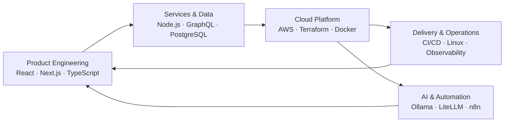

<div align="center">

# Luke Prescott

### Senior Software Engineer

Building resilient web platforms, cloud systems, developer tooling, and practical AI infrastructure.

<p>
  <a href="https://www.lukeprescott.dev/">
    
  </a>
  <a href="mailto:contact@lukeprescott.dev">
    
  </a>
  <a href="https://linkedin.com/in/lukerobertprescott">
    
  </a>
</p>

</div>

```typescript
const luke = {
  role: "Senior Software Engineer",
  builds: [
    "web platforms",
    "cloud systems",
    "developer tooling",
    "AI infrastructure",
  ],
  values: ["clarity", "reliability", "automation", "maintainability"],
} as const;
```

## About

I am a full-stack software engineer focused on designing and delivering dependable products across frontend applications, backend services, cloud infrastructure, and developer tooling.

My work centers on TypeScript, React, Node.js, GraphQL, PostgreSQL, and AWS. I enjoy simplifying complicated systems, defining clear architectural boundaries, improving developer experience, and automating work that should not require repeated human effort.

## Engineering Map



## Core Toolkit

<p>
  
  
  
  
  
  
</p>

<p>
  
  
  
  
  
  
</p>

## Engineering Strengths

<p>
  
  
  
  
  
  
  
  
  
  
</p>

## Technology Depth

<details>
  <summary><strong>Frontend & Product Engineering</strong></summary>
  <br />

  <p>
    
    
    
    
    
    
    
  </p>

  <p>
    
    
    
    
    
  </p>

Component architecture · Design systems · Responsive interfaces · Accessibility · State management · Forms and validation · Media experiences · Automated testing

</details>

<details>
  <summary><strong>Backend, APIs & Data</strong></summary>
  <br />

  <p>
    
    
    
    
    
    
  </p>

  <p>
    
    
    
    
  </p>

  <p>
    
    
    
    
    
  </p>

API design · GraphQL schemas · Relational modeling · Authentication · Search · Migrations · Service integrations · Background processing

</details>

<details>
  <summary><strong>AWS & Cloud Architecture</strong></summary>
  <br />

  <p>
    
    
    
    
    
    
  </p>

  <p>
    
    
    
    
    
    
    
  </p>

  <p>
    
    
    
  </p>

Serverless architecture · Infrastructure as code · Event-driven systems · Content delivery · Authentication · Containers · Secure cloud delivery

</details>

<details>
  <summary><strong>Delivery, Operations & Developer Tooling</strong></summary>
  <br />

  <p>
    
    
    
    
    
    
  </p>

  <p>
    
    
    
    
    
  </p>

CI/CD · Containerized environments · Build optimization · Dependency management · Monitoring · Logging · Reverse proxies · Operational automation

</details>

<details>
  <summary><strong>AI, Automation & Self-Hosting</strong></summary>
  <br />

  <p>
    
    
    
    
    
    
  </p>

Local model hosting · Model gateways · Workflow automation · AI-assisted development · Private infrastructure · Homelab operations

</details>

## Engineering Principles

```text
Make complex systems understandable.
Design for the next engineer, not only the first release.
Automate repetitive work.
Treat testing and observability as product capabilities.
Prefer clear boundaries over clever abstractions.
Balance technical quality with practical delivery.
```

## Beyond the Day Job

Outside of professional software development, I experiment with:

* Local-first AI and model orchestration
* Self-hosted infrastructure and homelab systems
* Cloud automation and infrastructure as code
* Interactive genealogy and relationship visualization
* Gaming infrastructure and server automation

## Contact

<p>
  The best way to reach me is
  <a href="mailto:contact@lukeprescott.dev"><strong>contact@lukeprescott.dev</strong></a>.
</p>

<p>
  <a href="https://www.lukeprescott.dev/">Website</a>
  ·
  <a href="https://linkedin.com/in/lukerobertprescott">LinkedIn</a>
  ·
  <a href="https://github.com/lprescott?tab=repositories">Repositories</a>
</p>
